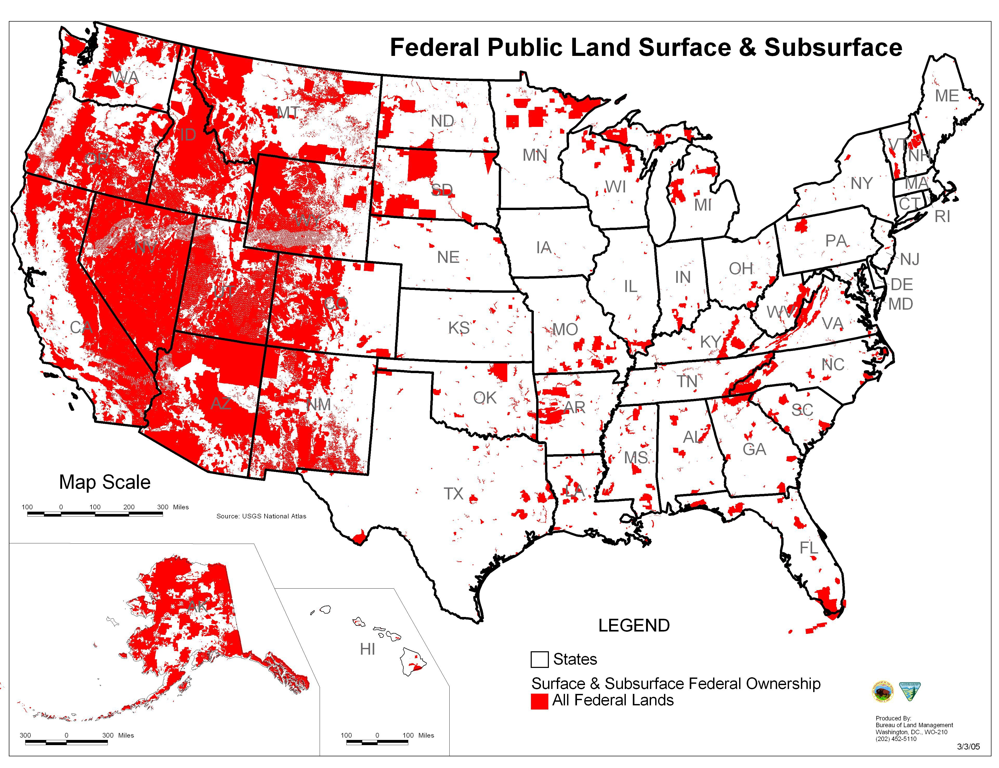

## Federal Public Land

## [Bash Infinity](https://github.com/niieani/bash-oo-framework)

Who knew you could do all this with bash?

## [Microsoft underwater data center live cameras](https://natick.research.microsoft.com/)

## [By 1303, the Chinese were solving equations of the 14th degree. What practical problem motivated such a result?](https://www.reddit.com/r/AskHistorians/comments/9bkfhj/by_1303_the_chinese_were_solving_equations_of_the/)

Interesting question and answer.

## [Checking Dependent Types with Normalization by Evaluation: A Tutorial](http://davidchristiansen.dk/tutorials/nbe/)

David Christiansen does write great tutorials, but scheme...

[A Semantics-Directed Compiler Generator](/static/semantics-directed-compiler-generator.pdf)
[Semantics of Programming Languages: A Tool-Oriented Approach](/static/semantics-of-programming-languages.pdf)

[A Realistic Compiler Generator Based on High-Level Semantics](/static/compiler-generator.pdf)
[SIS -- Semantics Implementation System](/static/sis.pdf)
